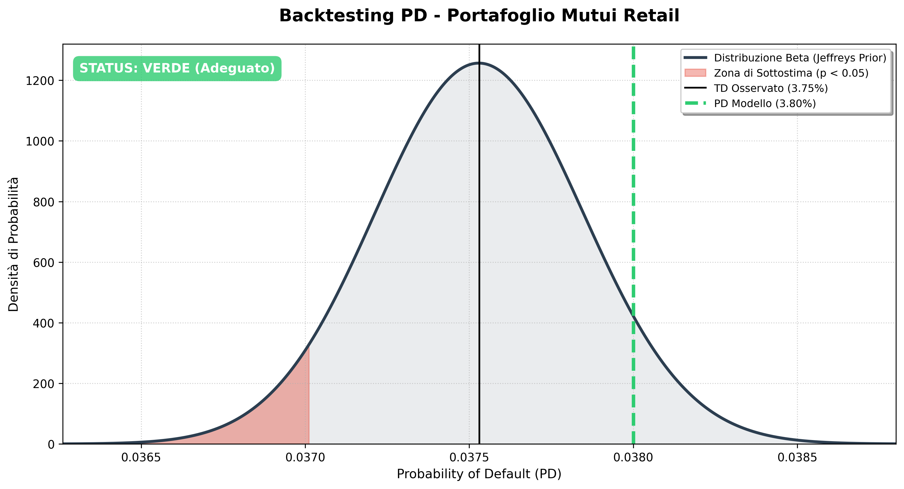
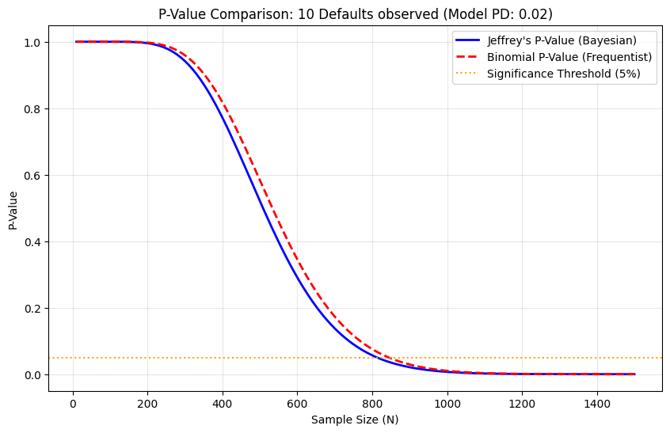

# PD Model Validation Framework: Jeffrey’s Test vs. Binomial Approach

This repository provides an advanced Python toolkit for the validation of **Probability of Default (PD)** models. It specifically addresses the challenges of **Low-Default Portfolios (LDP)** by implementing a comparative analysis between Bayesian (Jeffrey’s) and Frequentist (Binomial) statistical frameworks.

The project is designed to meet the rigorous standards set by the **European Central Bank (ECB)** and the **European Banking Authority (EBA)**.

---

## Regulatory Framework & Compliance

### 1. ECB Instruction 2.5.3 (Predictive Ability)
According to the **ECB Instructions on Validation Reporting (Section 2.5.3)**, banks must demonstrate the predictive power of their internal models. For LDPs, where default events are sparse, traditional tests often lack the necessary power. This tool implements the Jeffrey’s Test as a robust alternative to ensure model accuracy.

### 2. Supervisory Guide 2025 & EBA/GL/2017/16
The **ECB Supervisory Guide 2025** emphasizes the "Principle of Prudence." This tool helps quantify the **Margin of Conservatism (MoC)** by identifying if a model systematically underestimates risk, a key requirement for **IRB (Internal Rating-Based)** systems.

---

## The "Zero-Default" Paradox: Frequentist vs. Bayesian

A core feature of this study is the comparison between the **Binomial Test** and the **Jeffrey’s Test**, particularly in cases where no defaults are observed ($D=0$).

| Feature | Binomial Test (Frequentist) | Jeffrey's Test (Bayesian) |
| :--- | :--- | :--- |
| **Philosophy** | Relies solely on observed data. | Incorporates a non-informative $Beta(0.5, 0.5)$ prior. |
| **LDP Performance** | Low power. Often yields $p=1.0$ if $D=0$. | High power. Provides a conservative p-value. |
| **Regulatory Fit** | Standard, but prone to "type II" errors. | Recommended for its "Healthy Skepticism." |
| **Interpretation** | Probability of observing $D$ defaults. | Probability that the true PD exceeds the model PD. |

### Why it matters
In a portfolio with zero defaults, a Binomial test might fail to reject a poorly calibrated model. Jeffrey’s Test, by assuming a baseline prior, calculates the probability of underestimation even in the absence of events, ensuring higher safety margins for the bank's capital.

---

## Statistical Implementation

The tool uses the **Posterior Beta Distribution** to model the uncertainty of the PD:
$$f(p | D, N) = \frac{p^{D+0.5-1}(1-p)^{N-D+0.5-1}}{B(D+0.5, N-D+0.5)}$$

### Key Functions:
* `jeffreys_test()`: Calculates the Bayesian p-value and generates the Posterior PDF.
* `compare_methodologies()`: Provides a side-by-side comparison with the Binomial CDF.
* `traffic_light_report()`: Categorizes results into Green/Yellow/Red zones ($p \leq 0.05$ for rejection).

---

## Visual Analytics

The tool generates HD visualizations to assist in **Validation Reporting**:
1. **Posterior PDF Plot:** Visualizes the probability density of the PD.
2. **Comparison Curve:** Shows how the Bayesian p-value evolves vs. the Frequentist one as the sample size ($N$) increases.

---

## Installation & Usage
1. Clone the repository.
2. Ensure you have `numpy`, `scipy`, and `matplotlib` installed.
3. Run the Python script to generate the comparative analysis.
4. Use the interactive Google Colab notebook for quick bucket-level checks.

---
**Project Lead:** Vittorio Pascale  
**Keywords:** Risk Management | Model Validation | Basel III | Bayesian Statistics | Python
